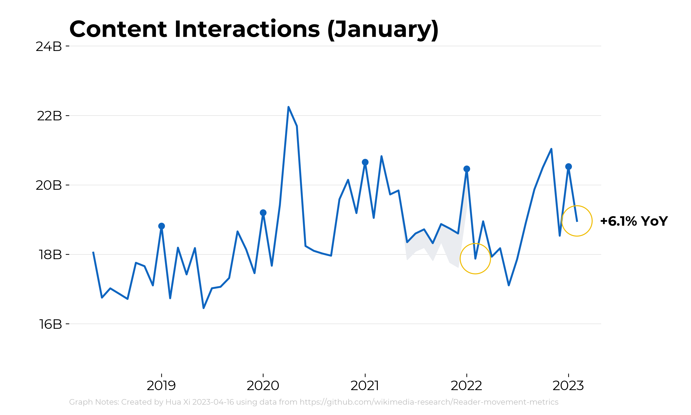
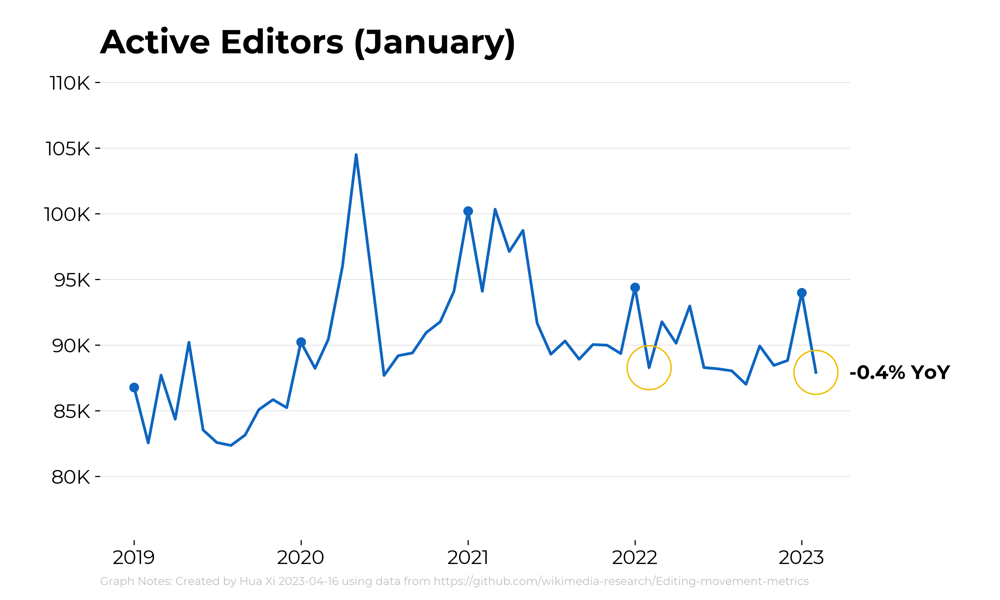
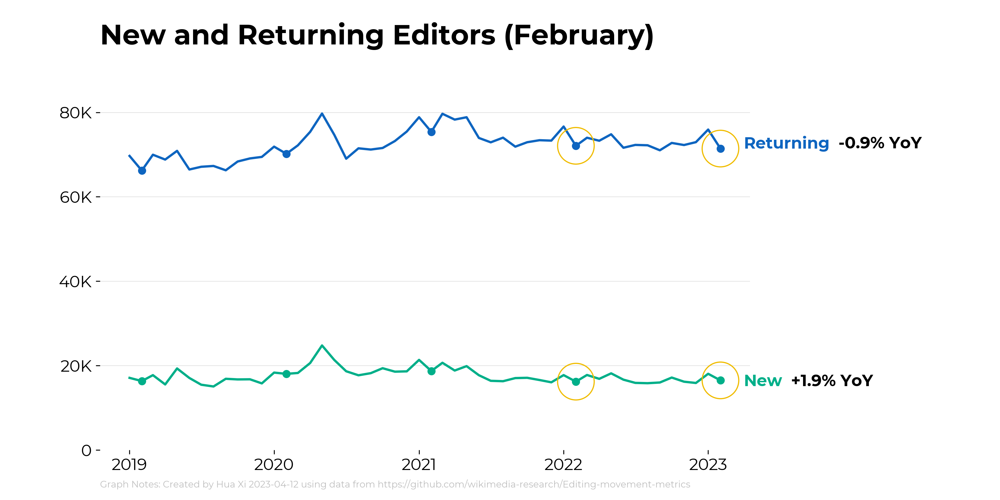
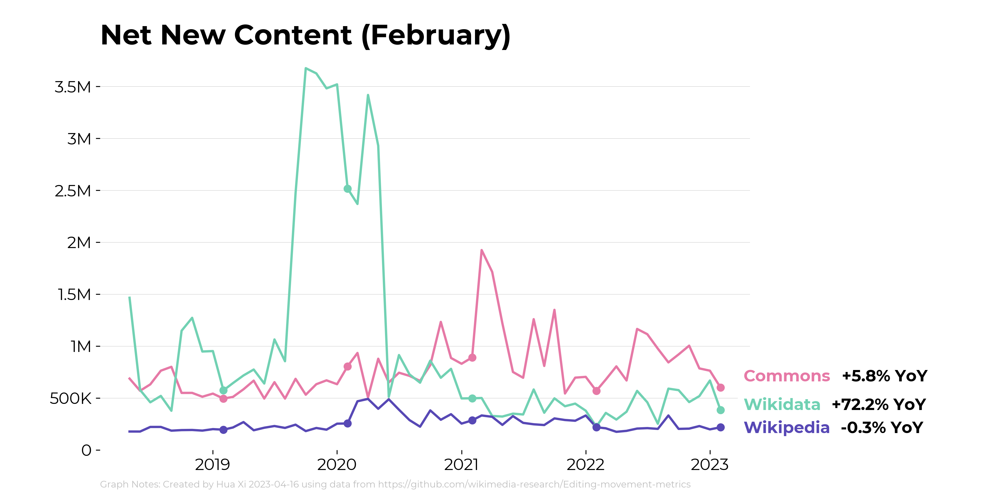
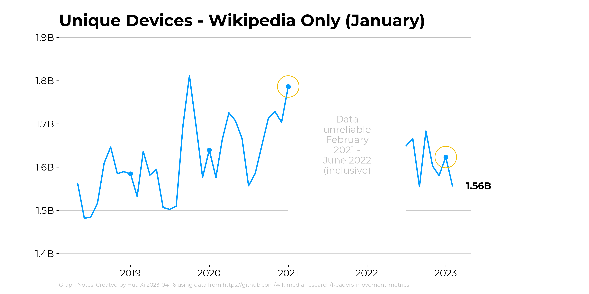
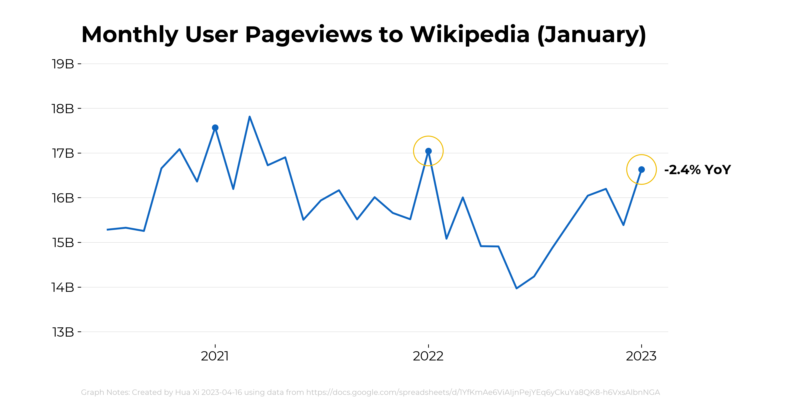
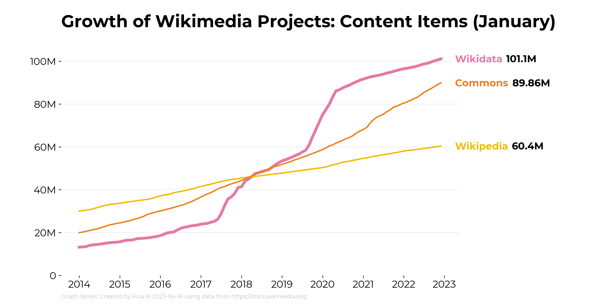
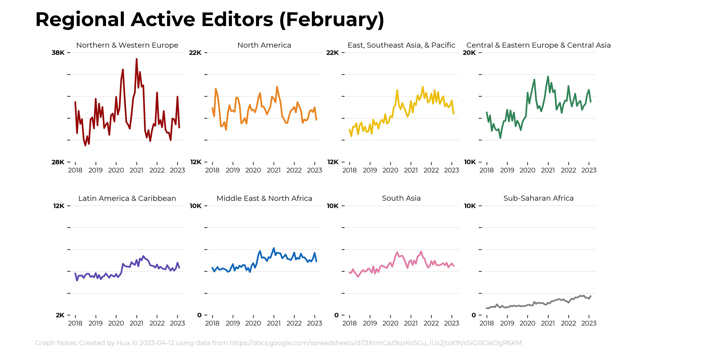
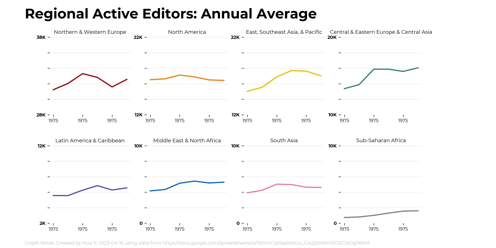
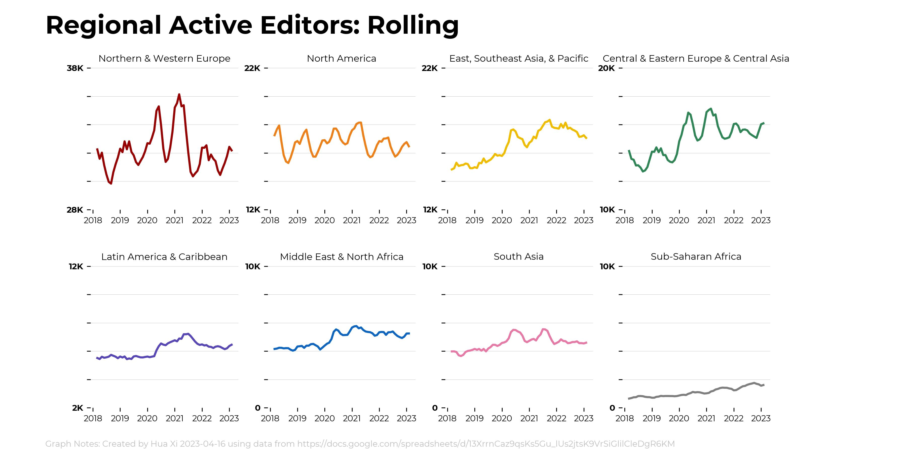

# Key Product Metrics

This repository has code for generating key product metrics charts using python/matplotlib. Current charts are below:

Examples of past Key Product Metrics Charts can be found here: https://docs.google.com/presentation/d/1D_MuQ4Cf23Agn1o_ausJtH5rrJysqtGIYzmK8xxEX7M/edit#slide=id.g1be0d48db42_0_336

## Content Interactions

## Active Editors

## New and Returning Editors

## Net New Content

## Unique Devices

## Pageviews - Monthly Automated

## Pageviews - Pageviews_Useronly

## Pageviews by Referral Source

## Project Growth

## Country Breakdown

## Regional Active Editors (8-Chart View)

Also available for rolling, quarterly and annual version of the data. 

Also available in 4-chart per figure view. 

Also available for Unique Devices.
