# Key Product Metrics

This repository has code for generating key product metrics charts using python/matplotlib. Current charts are below:

Examples of past Key Product Metrics Charts can be found here: https://docs.google.com/presentation/d/1D_MuQ4Cf23Agn1o_ausJtH5rrJysqtGIYzmK8xxEX7M/edit#slide=id.g1be0d48db42_0_336

## Content Interactions

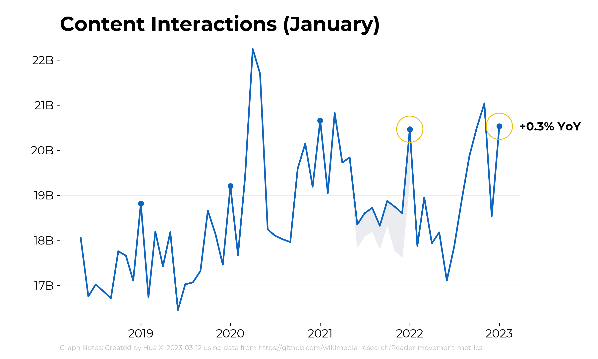

## Active Editors

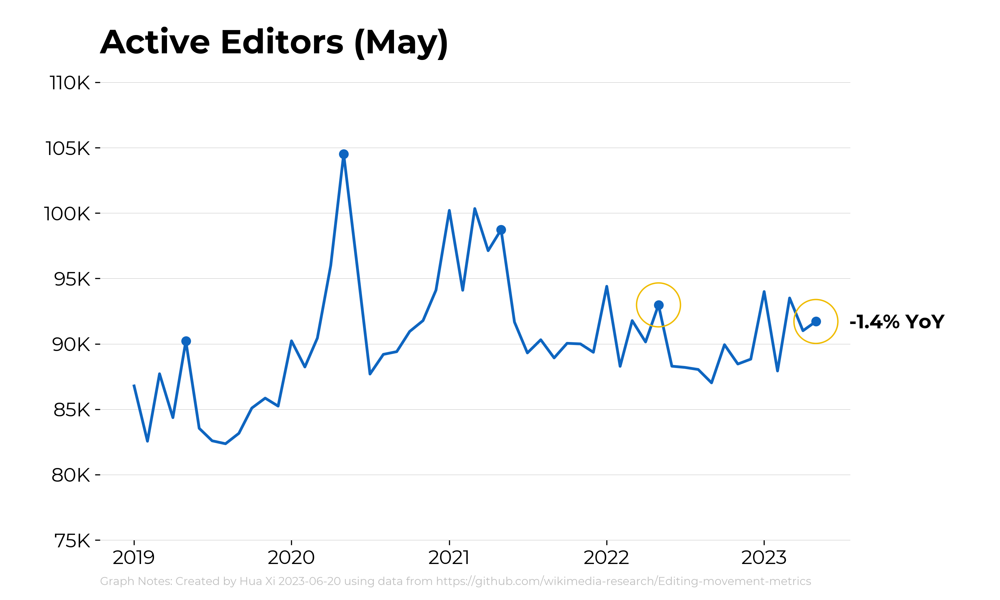

## New and Returning Editors

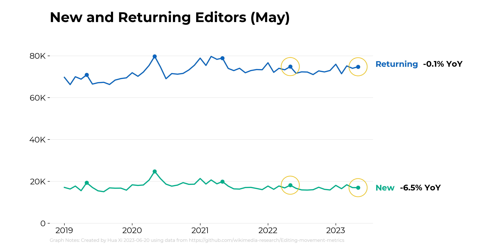

## Net New Content

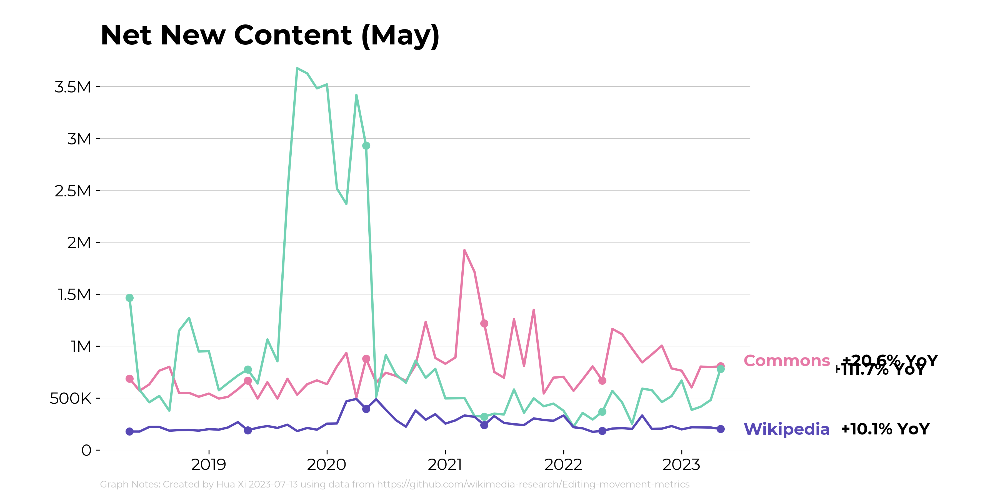

## Unique Devices

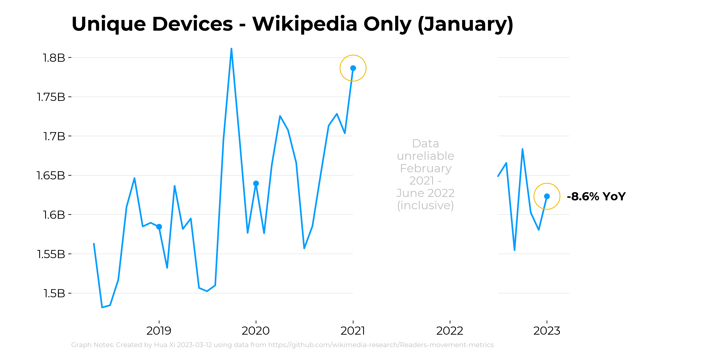

## Pageviews - Access Method

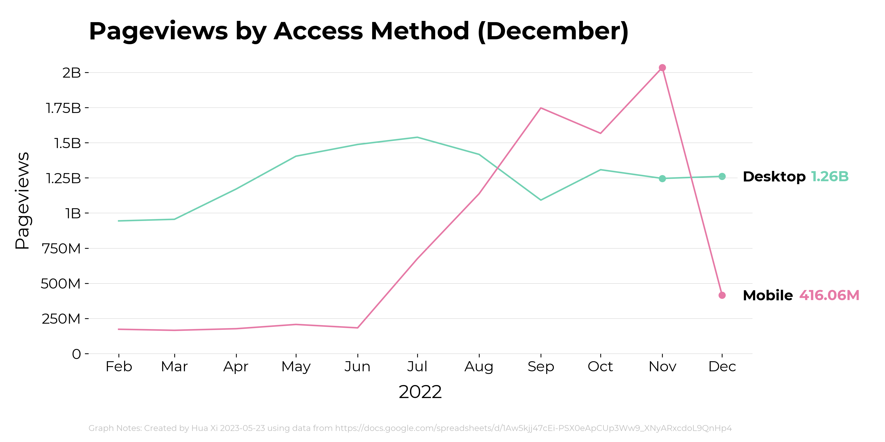

## Pageviews - Monthly Automated

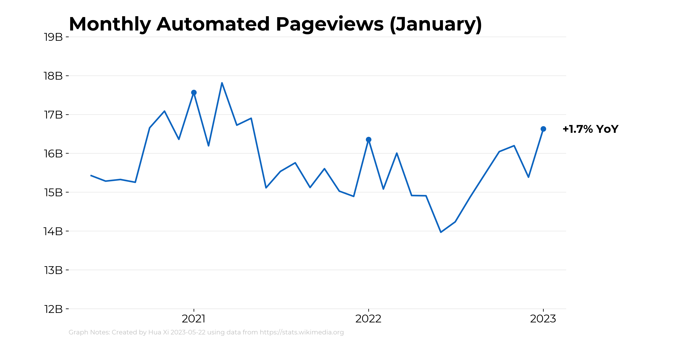

## Pageviews - Pageviews_Useronly

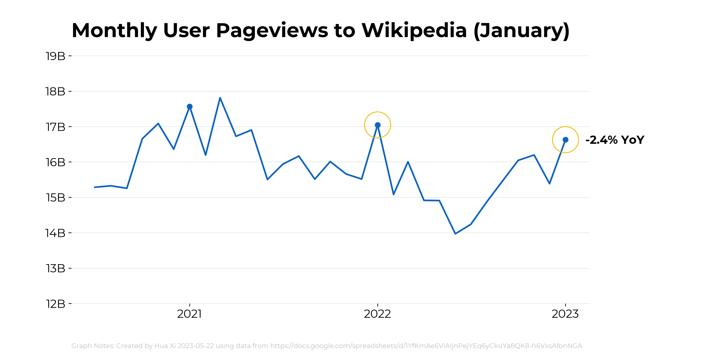

## Pageviews by Referral Source

## Project Growth

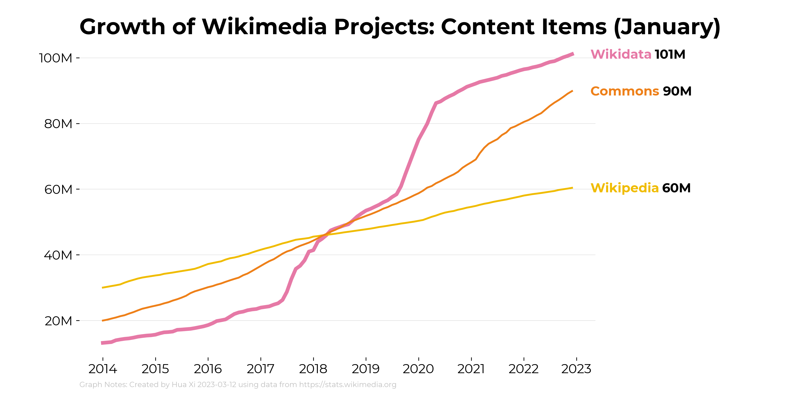

## Country Breakdown

## Regional Active Editors (8-Chart View)

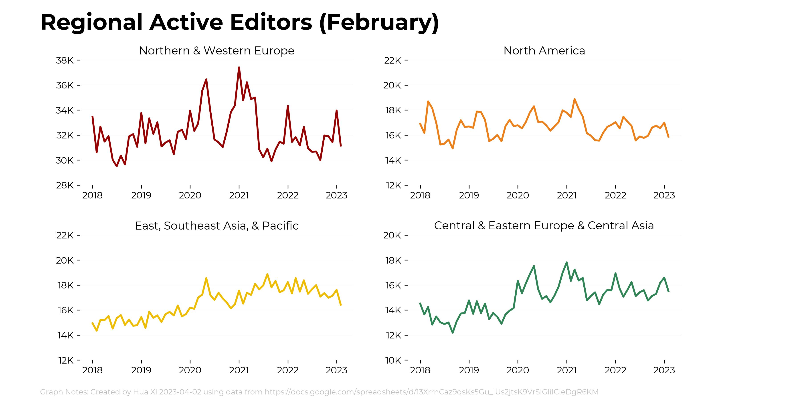

Also available for rolling, quarterly and annual version of the data. 

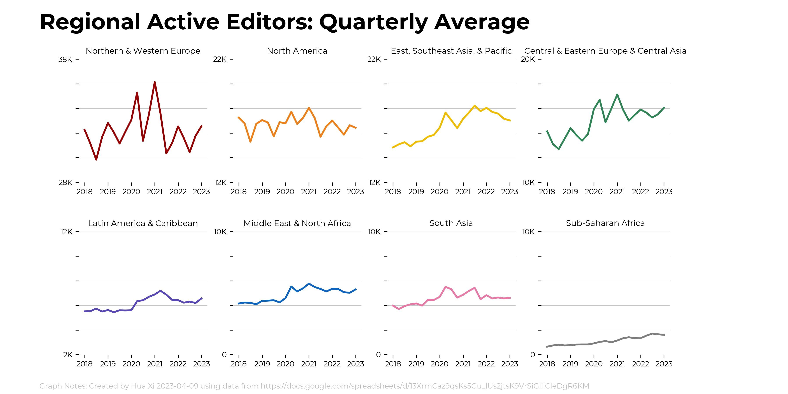

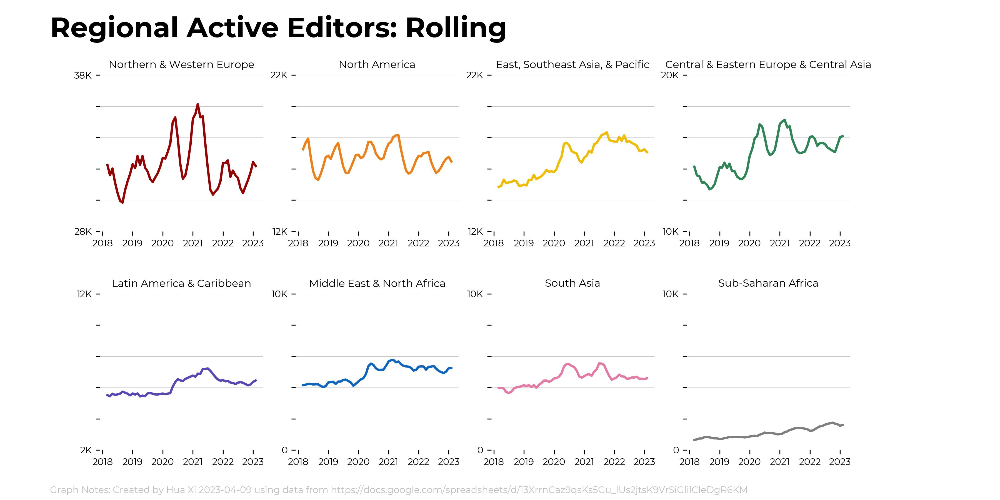

Also available for individual views.

## Regional Unique Devices (8-Chart View)

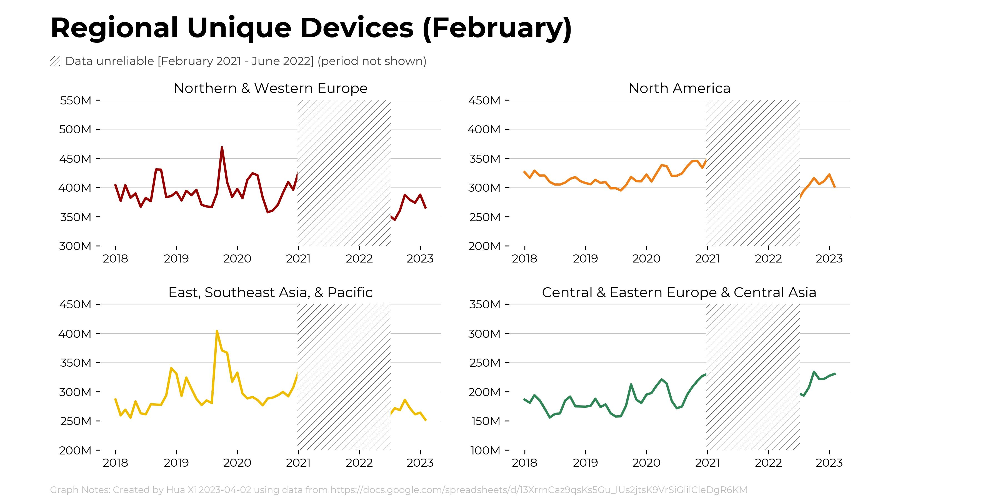

## Map Charts

