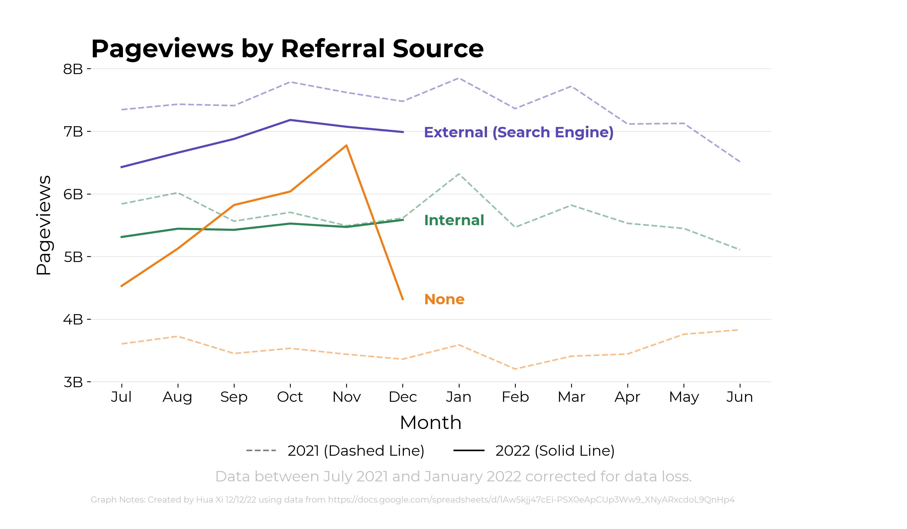

# Key Product Metrics

This repository has code for generating key product metrics charts using python/matplotlib. Current charts are below:

Examples of past Key Product Metrics Charts can be found here: https://docs.google.com/presentation/d/1D_MuQ4Cf23Agn1o_ausJtH5rrJysqtGIYzmK8xxEX7M/edit#slide=id.g1be0d48db42_0_336

## Content Interactions

## Active Editors

## New and Returning Editors

## Net New Content

## Unique Devices

## Pageviews by Access Source

## Pageviews by Referral Source

## Country Breakdown

## Project Growth

