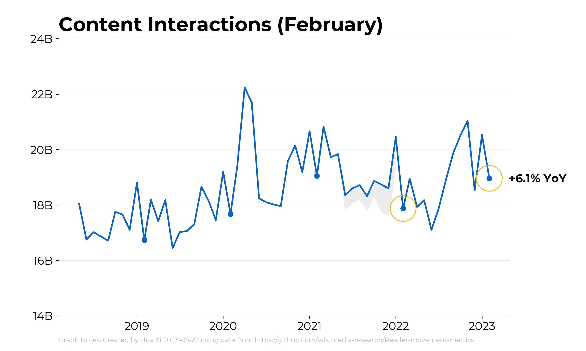
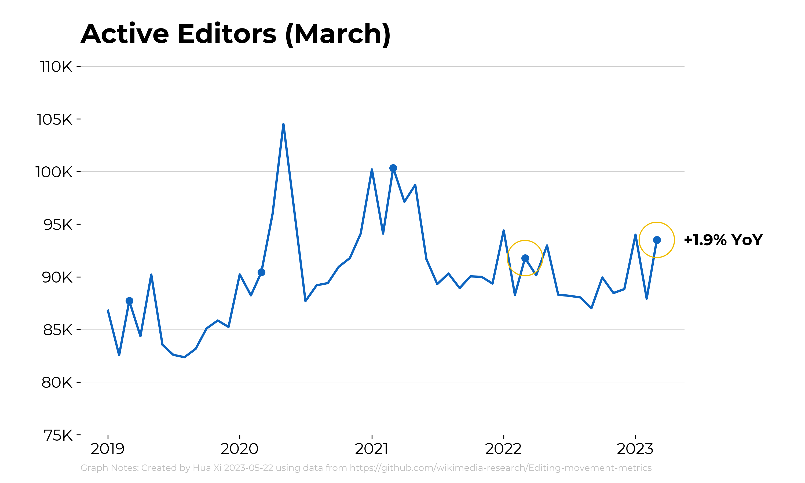
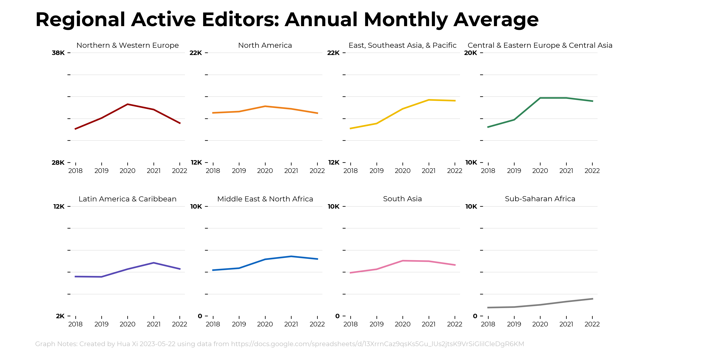

This folder has code for generating key product metrics charts using Matplotlib. Current charts are below.

Examples of past movement metrics charts can be found here: https://docs.google.com/presentation/d/1D_MuQ4Cf23Agn1o_ausJtH5rrJysqtGIYzmK8xxEX7M/edit#slide=id.g1be0d48db42_0_336

## Use
You can run any individual chart script or run EDITOR_METRICS.ipynb and READER_METRICS.ipynb for standard monthly metrics charts

Data format is specified with "#Data Columns: ..." comments.

By default, charts are saved in this repository's `charts` directory. You can specify a different location by editing `parameters.py` in this directory.

!!! Note that some charts may appear formatted incorrectely in the jupyter notebooks window but the saved image file will be correct. !!!

## Content Interactions

## Active Editors

## New and Returning Editors

## Net New Content

## Unique Devices

## Pageviews - Access Method

## Pageviews - Monthly Automated

## Pageviews - Pageviews_Useronly

## Pageviews by Referral Source

## Project Growth

## Regional Active Editors (8-Chart View)

Also available for rolling, quarterly and annual version of the data. 

Also available for individual views.

## Regional Unique Devices (8-Chart View)

## Map Charts

